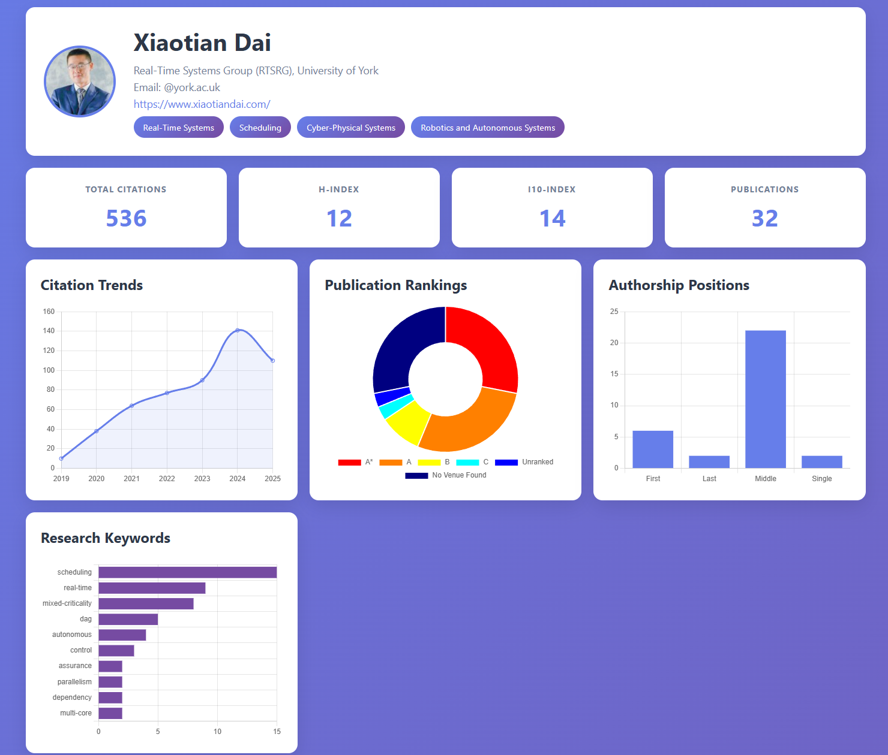

# ScholarInsights

A comprehensive toolkit for fetching, analyzing, and visualizing Google Scholar profiles. ScholarInsights provides powerful insights into academic publication metrics, venue rankings, and research trends.





## Features
- **Data Fetching**: Robust retrieval of author profiles and publication history.
- **KPI Analysis**: Calculation of total citations, yearly trends, h-index, and key research areas.
- **Authorship Analysis**: Determination of author position (First, Middle, Last, Single).
- **Publication Ranking**: Automated mapping of venues to rankings (A*, A, B, C).
- **Web Dashboard**: Interactive visualization dashboard with charts and statistics.

## Installation

1. Clone the repository.
2. Install dependencies:
   ```bash
   pip install -r requirements.txt
   ```
   
   This will install:
   - `flask` - Web framework for the dashboard
   - `scholarly` - Google Scholar API wrapper
   - `requests` - HTTP library
   - `fake-useragent` - User agent rotation

## Usage

### 1. Fetching Data (`fetch_data.py`)
This script retrieves data from Google Scholar and saves it to a JSON file.

**Option A: Search by Name (Lists candidates if multiple found)**
```bash
python3 scripts/fetch_data.py --author "Xiaotian Dai"
```

**Option B: Fetch by ID (Recommended for accuracy)**
If you know the Scholar ID (found in the URL of their profile, e.g., `user=<ID>`), use it directly:
```bash
python3 scripts/fetch_data.py --id "G7dzNUkAAAAJ" --limit 100
```
*`--limit` controls the number of publications to fetch full details for (default: 10). Set high for full analysis, but beware of time/rate limits.*

### 2. Analyzing Data (`analyze_data.py`)
Generates a report from the fetched JSON data.

```bash
python3 scripts/analyze_data.py --file author_data.json
```

**Options:**
- `--file`: Path to JSON file (default: `author_data.json`)
- `--verbose-ranking`: Show intermediate results when ranking publications (venue matching and rank assignment for each paper)

**Output Includes:**
- Total Citations & Yearly Trends
- Top Research Keywords
- Authorship Position Distribution
- Publication Rankings (based on `ranking_utils.py`)

**Verbose Ranking Example:**
```bash
python3 scripts/analyze_data.py --file author_data.json --verbose-ranking
```

This will display detailed information for each publication including:
- Publication title
- Venue name (or "NOT FOUND")
- Assigned rank (A*, A, B, C, Unranked, or No Venue Found)
- Summary statistics at the end

### 3. Web Dashboard (`app.py`)
Launch an interactive web dashboard to visualize the author data.

```bash
python3 app.py
```

Then open your browser and navigate to `http://localhost:5000`

**Dashboard Features:**
- **Profile Overview**: Author name, affiliation, interests, and profile picture
- **Key Metrics**: Total citations, h-index, i10-index, publication count
- **Citation Trends**: Line chart showing citations over time
- **Publication Rankings**: Doughnut chart of venue rankings (A*, A, B, C)
- **Authorship Positions**: Bar chart showing First/Middle/Last/Single author positions
- **Research Keywords**: Horizontal bar chart of top research terms
- **Top Publications**: List of publications with citations and links

The dashboard automatically loads data from `author_data.json` in the root directory.

## Configuration

- **Proxies**: `fetch_data.py` attempts to use free proxies. For production use, configure `scholarly` with a paid proxy in `setup_proxy()`.
- **Rankings**: `ranking_utils.py` loads rankings from `scripts/venue_ranks.json`.
  - To add new venues, simply edit `venue_ranks.json`.
  - Format: `"venue_name_lowercase": "RANK"` (e.g., `"rtss": "A*"`).
  
### Ranking Systems

- **Conferences**: Rankings are based on **CORE Conference Ranking** (A*, A, B, C tiers).
  - CORE is the standard ranking system for computer science conferences.
  - See: https://portal.core.edu.au/conf-ranks/
  
- **Journals**: Since CORE discontinued journal rankings in February 2022, journal rankings use alternative metrics:
  - **Impact Factor (IF)** from Journal Citation Reports (JCR)
  - **SCImago Journal Rank (SJR)**
  - **Q1/Q2 quartile classifications**
  - Rankings are assigned based on these metrics, maintaining consistency with CORE's A*/A/B/C tier system where:
    - **A***: Top-tier journals (very high impact, Q1, prestigious)
    - **A**: High-quality journals (high impact, Q1)
    - **B**: Good journals (moderate impact, Q1-Q2)
    - **C**: Reputable journals (lower impact but still recognized)

## Project Structure

```
scholarinsights/
├── app.py                      # Flask web application
├── author_data.json            # Author data (generated by fetch_data.py)
├── requirements.txt            # Python dependencies
├── README.md                   # This file
├── scripts/
│   ├── __init__.py            # Package initialization
│   ├── fetch_data.py          # Data retrieval script
│   ├── analyze_data.py        # Analysis and reporting script
│   ├── ranking_utils.py       # Ranking logic helper
│   ├── venue_ranks.json      # Venue ranking database
│   └── test_fetch.py          # Test script
└── templates/
    └── index.html             # Dashboard frontend
```

## Files
- `app.py`: Flask web application serving the dashboard and API endpoints
- `scripts/fetch_data.py`: Data retrieval script for Google Scholar
- `scripts/analyze_data.py`: Analysis and reporting script with `ScholarAnalyzer` class
- `scripts/ranking_utils.py`: Ranking logic helper for venue classification
- `scripts/venue_ranks.json`: Database of venue rankings
- `templates/index.html`: Interactive dashboard frontend with Chart.js visualizations
- `author_data.json`: Generated author data file (created by `fetch_data.py`)

## API Endpoints

The Flask app provides the following endpoints:
- `GET /` - Main dashboard page
- `GET /api/data` - Raw author data JSON
- `GET /api/analysis` - Analyzed statistics and visualizations data

## License

This project is licensed under the MIT License - see the [LICENSE](LICENSE) file for details.
